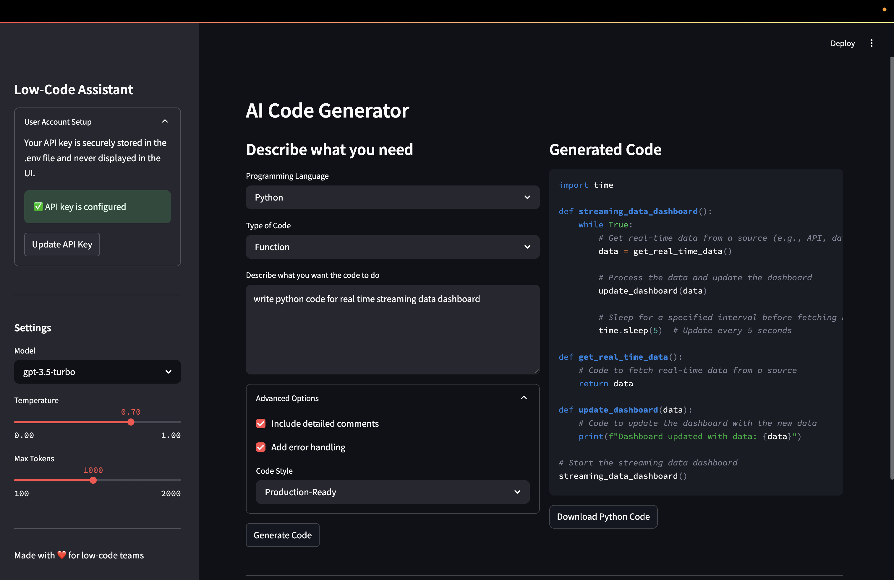

# Low-Code Assistant


A powerful AI-powered code generation tool designed specifically for low-code teams. This application helps developers quickly generate, understand, and transform code using OpenAI's language models.

## 🚀 Features

- **AI-Powered Code Generation**: Generate code snippets in multiple programming languages
- **Multiple Programming Languages**: Support for Python, JavaScript, Java, C#, and more
- **Customizable Output**: Control verbosity, comments, and error handling
- **Secure API Key Management**: Your OpenAI API key is stored securely in your user profile
- **Simple, Intuitive UI**: Built with Streamlit for a clean, responsive interface
- **User Authentication System**: Secure login and registration with SQLite database
- **Live Code Editor**: Edit code in real-time with syntax highlighting
- **AI Code Suggestions**: Get AI-powered suggestions to improve your code
- **Implement Suggestions**: Automatically apply AI-suggested improvements with one click
- **Code Diff Views**: See side-by-side and diff comparisons of original vs. improved code
- **Toast Notifications**: Real-time status updates appear in the top-right corner
- **Containerized Deployment**: Docker and Kubernetes support for easy deployment
- **Secure Database**: User data and API keys stored in SQLite with proper security measures

## 🛠️ Tech Stack

### Core Technologies
- **Python 3.9+**: Primary programming language
- **Streamlit**: Web application framework for the user interface
- **OpenAI API**: Powers the AI-assisted code generation and suggestions
- **SQLite**: Database for user accounts and session management

### Frontend
- **Streamlit Components**: For interactive UI elements
- **Streamlit Ace Editor**: Code editor with syntax highlighting
- **Streamlit Forms**: For input collection and validation
- **Streamlit Toast Notifications**: For real-time status updates
- **Custom CSS**: For styling enhancements
- **Difflib Integration**: For visualizing code changes

### Backend
- **SQLite3**: Lightweight database for user data storage
- **Python Standard Library**:
  - **pathlib**: Path manipulation
  - **hashlib**: Password hashing
  - **secrets**: Secure token generation
  - **contextlib**: Context management
  - **difflib**: Code difference visualization

### Authentication & Security
- **Password Hashing**: Secure storage of user passwords
- **Session Management**: Secure user sessions
- **API Key Storage**: Protected storage of OpenAI API keys

### DevOps & Deployment
- **Docker**: Containerization for consistent deployment
- **Kubernetes**: Orchestration for production deployment
- **Nginx**: Web server (used in Kubernetes setup)
- **Environment Variables**: For configuration management

### Development Tools
- **Git**: Version control
- **GitHub**: Code repository and collaboration
- **Visual Studio Code**: Recommended IDE for development

## 📋 Prerequisites

- Python 3.8 or higher
- OpenAI API key ([Get one here](https://platform.openai.com/account/api-keys))
- Git (for cloning the repository)

## 🔧 Setup Options

You can set up the Low-Code Assistant in three ways: local setup, Docker, or Kubernetes.

### Option 1: Local Setup

#### 1. Clone the Repository

```bash
# Clone the repository
git clone https://github.com/yourusername/low-code-assistant.git
cd low-code-assistant
```

#### 2. Create a Virtual Environment

```bash
# Create a virtual environment
python -m venv venv

# Activate the virtual environment
# On macOS/Linux:
source venv/bin/activate

# On Windows:
venv\Scripts\activate
```

#### 3. Install Dependencies

```bash
pip install -r requirements.txt
```

#### 4. Set Up Your OpenAI API Key

Create a `.env` file in the project root directory:

```env
# OpenAI API Configuration
OPENAI_API_KEY=your_openai_api_key_here

# Application Settings
APP_ENV=development
```

Alternatively, you can add your API key through the application's User Account Setup section when you run the app.

#### 5. Run the Application

```bash
# Run the simplified version (recommended for first-time users)
streamlit run simple_app.py

# Or run the full application
streamlit run app/main.py
```

The application will open in your browser at `http://localhost:8501`

### Option 2: Docker Deployment

For a containerized setup, you can use Docker:

#### 1. Build the Docker Image

```bash
docker build -t low-code-assistant:latest .
```

#### 2. Run the Container

```bash
docker run -d -p 8501:8501 --name low-code-assistant low-code-assistant:latest
```

#### 3. Access the Application

Open your browser and navigate to `http://localhost:8501`

#### 4. Stop and Remove the Container

```bash
docker stop low-code-assistant
docker rm low-code-assistant
```

### Option 3: Kubernetes Deployment

For production-grade deployment, use our Kubernetes configuration:

#### 1. Prerequisites

- Kubernetes cluster (local like Minikube or remote)
- kubectl installed and configured
- Docker registry access (for storing images)

#### 2. Using the Deployment Script

We provide a deployment script (`deploy.sh`) that simplifies the Kubernetes deployment process:

```bash
# Make the script executable
chmod +x deploy.sh

# Full deployment (build, push, deploy)
./deploy.sh --registry your-registry.com --tag v1.0.0 all

# Or run individual steps:
./deploy.sh build     # Only build the image
./deploy.sh push      # Only push to registry
./deploy.sh deploy    # Only deploy to Kubernetes
```

#### 3. Manual Kubernetes Deployment

If you prefer to deploy manually:

```bash
# Apply namespace first
kubectl apply -f k8s/namespace.yaml

# Apply other resources
kubectl apply -f k8s/configmap.yaml
kubectl apply -f k8s/secret.yaml   # Create this file with your secrets
kubectl apply -f k8s/deployment.yaml
kubectl apply -f k8s/service.yaml
kubectl apply -f k8s/ingress.yaml
```

#### 4. Accessing the Application

The application will be available at the host configured in your ingress resource (default: `https://low-code-assistant.example.com`).

You may need to update your DNS or hosts file to point to your cluster's ingress controller IP.



**Key Components & Highlights:**

* **Model Integration:** Either embed a smaller code-focused model locally or leverage an API for code completions.
* **Fine-Tuning:** Train/fine-tune on publicly available GitHub repos to specialize in certain languages or frameworks.
* **Live Editor:** Provide a browser-based editor with real-time suggestions.
* **Cloud-Native Deployment:** Fully containerized with Docker and production-ready Kubernetes manifests for scalable, resilient deployment.

## 🤖 Using the Application

### User Authentication

1. **Create an Account**:
   - When you first open the application, you'll see a login/register button in the sidebar
   - Click it to open the authentication page
   - Choose the "Register" tab to create a new account
   - Fill in your details (username, email, password)

2. **Login**:
   - Enter your username/email and password
   - Your session will be remembered until you log out

3. **Manage Your Profile**:
   - Click "View Profile" in the sidebar to access your user profile
   - Configure your OpenAI API key securely in your profile

### API Key Management

1. **Add Your API Key**:
   - Get an OpenAI API key from [OpenAI's website](https://platform.openai.com/api-keys)
   - Add it through your user profile or the API Key section in the sidebar
   - Your key is securely stored and never shared

2. **Using Your API Key**:
   - Once configured, the application will use your API key for all AI operations
   - You can clear or update your API key at any time

### Generating and Improving Code

1. **Generate Code**:
   - Select your programming language
   - Choose the type of code you want to generate
   - Describe what you want the code to do
   - Set advanced options for comments, error handling, and code style
   - Click "Generate Code"

2. **Work with Generated Code**:
   - View the generated code in the "Generated Code" tab
   - Switch to the "Live Editor" tab to modify the code
   - Download the code with the "Download Code" button

3. **Improve Your Code**:
   - With code in the editor, click "Get AI Suggestions" to receive improvement recommendations
   - Review the AI's suggestions
   - Click "Implement Suggestions" to have the AI automatically apply the improvements
   - You'll see toast notifications in the top-right corner showing the progress
   - Review the side-by-side comparison of the original and improved code
   - Examine the detailed diff view showing exactly what changes were made
   - The improvements are automatically applied to your code in the editor

## 🔄 Making Changes & Pushing to GitHub

### Important Considerations

1. **Database Security**: 
   - The database with user credentials is stored in the `data/` directory
   - This directory is already added to `.gitignore` to prevent accidentally pushing user data
   - Make sure to never commit the `data/users.db` file to your repository

2. **API Keys**: 
   - Never commit API keys to GitHub
   - Keep the `.env` file in `.gitignore`
   - For Kubernetes deployments, use secrets for storing API keys

### Setting Up Your GitHub Repository

```bash
# Initialize Git repository (if not cloned)
git init

# Add all files (the .gitignore will exclude sensitive files)
git add .

# Create initial commit
git commit -m "Initial commit of Low-Code Assistant"

# Add remote repository
git remote add origin https://github.com/yourusername/low-code-assistant.git

# Push to GitHub
git push -u origin main
```

### Contributing Guidelines

When making changes to the Low-Code Assistant:

1. **Create a feature branch**:
   ```bash
   git checkout -b feature/my-new-feature
   ```

2. **Make your changes**:
   - Follow the code style of the project
   - Add tests if possible
   - Update documentation accordingly

3. **Test your changes**:
   - Run the application locally and test all affected features
   - For authentication changes, ensure user data is handled securely

4. **Commit your changes**:
   ```bash
   git commit -m "Add feature: detailed description of changes"
   ```

5. **Push to your branch**:
   ```bash
   git push origin feature/my-new-feature
   ```

6. **Create a Pull Request**:
   - Go to GitHub and create a pull request
   - Describe your changes in detail
   - Mention any issues that your PR addresses

### Important: Protect Your API Key

Make sure your `.env` file is included in `.gitignore` to prevent your API key from being pushed to GitHub:

```bash
# Create or edit .gitignore
echo ".env" >> .gitignore
git add .gitignore
git commit -m "Add .gitignore to protect API keys"
```

## 🧩 Project Structure

```
low_code_assistant/
├── app/               # Full application code
│   ├── __init__.py
│   └── main.py       # Main application entry point
├── utils/            # Utility modules
│   ├── __init__.py
│   ├── code_generator.py  # AI code generation logic
│   └── template_manager.py  # Template management
├── templates/        # Code templates
├── static/           # Static assets (CSS, images)
├── config/           # Configuration files
├── k8s/              # Kubernetes deployment manifests
│   ├── namespace.yaml
│   ├── deployment.yaml
│   ├── service.yaml
│   ├── configmap.yaml
│   └── ingress.yaml
├── Dockerfile        # Docker configuration
├── deploy.sh         # Deployment automation script
├── .env              # Environment variables (not in git)
├── .env.template     # Template for environment variables
├── requirements.txt  # Project dependencies
├── simple_app.py     # Simplified application version
├── run.py            # Helper script to run the application
└── README.md         # Project documentation
```

## 🛠️ Troubleshooting

- **API Key Issues**: If you get errors about the API key, check that it's correctly set in `.env` or in the UI
- **Model Not Found**: If you get a "model not found" error, try selecting a different model from the dropdown
- **Dependency Errors**: If you have issues with dependencies, try updating pip: `pip install --upgrade pip`
- **Connectivity Issues**: Make sure you have an internet connection to access the OpenAI API
- **Docker Issues**: If the container fails to start, check logs with `docker logs low-code-assistant`
- **Kubernetes Issues**: Verify pod status with `kubectl get pods -n low-code-assistant` and check logs with `kubectl logs -n low-code-assistant <pod-name>`
- **Health Check Failures**: The application uses the path `/_stcore/health` for health checks. If probes are failing, check if this endpoint is accessible

## 📄 License

MIT

## 🤝 Contributing

Contributions are welcome! Please feel free to submit a Pull Request.

---

Created with ❤️ for low-code teams
